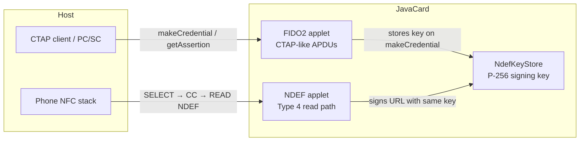

# CTAP-like + NDEF JavaCard Authenticator

## Important: not FIDO-compliant

> This project **is not FIDO Alliance certified** and **does not implement a complete, standards-conformant FIDO2/WebAuthn authenticator**.
>
> It **reuses CTAP-like command framing** (`makeCredential`, `getAssertion`, `getInfo`) for host integration convenience, but omits required FIDO features (PIN, U2F, credential management, full attestation model, and more) and may deviate from spec error handling and CBOR requirements.
>
> **Do not** deploy it where FIDO compliance, WebAuthn certification, or passkey interoperability is required without independent review.
>
> The NDEF path is a **custom signed-URL scheme**, not part of the FIDO or NFC Forum security model for authentication.

## What this is

This repository ships **two co-installed JavaCard applets** for JavaCard Classic 3.0.4+:

- [`applets/fido2/`](applets/fido2/) — CTAP-like signing over contact APDUs (PC/SC)
- [`applets/ndef/`](applets/ndef/) — passive NFC Type 4 tag that serves **dynamic signed HTTPS URLs**

The code is forked from the open-source [FIDO2Applet](https://github.com/BryanJacobs/FIDO2Applet) lineage and modified for a specific purpose: **generate a secp256r1 (P-256) private key on-card and use it to sign**. The same key is shared between both applets via the shareable [`NdefKeyStore`](applets/ndef/src/main/java/org/openjavacard/ndef/stub/NdefKeyStore.java) interface.

This is a **custom signing appliance**, not a general-purpose security key or passkey token.

## How it works (two interfaces, one key)



**CTAP-like path (contact / PC/SC)**

- The host sends CTAP-framed commands over APDUs.
- On `makeCredential`, the FIDO applet generates a **resident credential** with an **ECDSA P-256 key pair on-card** and pushes the signing key to the NDEF applet.
- On `getAssertion`, the same key signs challenge material returned to the host.
- The private key **never leaves the card**; hosts only receive signatures and public key material.

**NDEF path (contactless / tap)**

- A phone reads the tag with the standard Type 4 procedure (SELECT NDEF AID → capability container → NDEF file → READ).
- On each read session, the NDEF applet builds a **dynamic HTTPS URL**: your configured base URL plus query parameters (`pk`, `n`, `c`, `s`) where `s` is an ECDSA signature over `(counter || nonce)` using the **same P-256 key** provisioned during `makeCredential`.
- Your verifier checks the signed URL server-side — no CTAP session is required over NFC.

Until `makeCredential` has run with a resident key (`rk: true`), the NDEF applet may serve a placeholder URL.

## Register a new JavaCard

### Prerequisites

- **JavaCard SDK** (3.0.4+): `git submodule update --init sdks`
- **Built CAP files**: `./gradlew buildAllCaps` (requires `JC_HOME` or the bundled SDK under `sdks/`)
- **[GlobalPlatformPro](https://github.com/martinpaljak/GlobalPlatformPro)** (`gp`) on your `PATH`
- **PC/SC reader** with `pcscd` running; your user must be allowed to access the reader
- **Python venv** with dependencies from `requirements.txt` (same setup as `./gradlew testAll`):

```bash
python3 -m venv venv
./venv/bin/pip install -U -r requirements.txt
```

### 1. Configure

```bash
cp config/card.example.json config/card.json
# Edit config/card.json before provisioning
```

| Field | Purpose |
|-------|---------|
| `ndef_install.base_url` | HTTPS prefix for signed tap URLs (e.g. `https://your.server/verify`) |
| `gp.master_key` | SCP key used after `--lock` ([GlobalPlatformPro key syntax](https://github.com/martinpaljak/GlobalPlatformPro/wiki/Keys), usually `emv:…` hex) |
| `gp.card_lifecycle` | Set `run_before_install: true` on a **blank** card to initialize → secure → lock before install |
| `make_credential` | RP and user for the resident credential that wires the signing key to NDEF |
| `paths.fido_cap` / `paths.ndef_stub_cap` | CAP file paths (defaults match this repo layout) |

Keep `config/card.json` out of version control — it contains your `master_key`. Resume state is written to `config/card.json.provision-state.json` (also gitignored).

For a card **already locked** with your key, set `gp.card_lifecycle.run_before_install` to `false` and keep `gp.master_key` set so every `gp` invocation passes `-k`.

### 2. Provision

```bash
./register_card.sh config/card.json              # physical card
./register_card.sh config/card.json --dry-run    # print steps only
./register_card.sh config/card.json --virtual    # jcardsim smoke test (no reader)
```

The registration script performs these steps in order:

1. Optional card lifecycle (`--initialize-card`, `--secure-card`, `--lock`) for new blank cards
2. Delete existing FIDO/NDEF packages (when configured)
3. Install **NDEF applet first** — FIDO2 imports the NDEF package `.exp` and must load second
4. Install FIDO2 applet with CBOR install parameters from `fido_install`
5. Load attestation certificate via CTAP vendor command `0x46` (optional; skip if not needed)
6. `makeCredential` with `rk: true` — creates the on-card signing key **and** provisions NDEF
7. Optionally read and verify the NDEF signed URL over PC/SC

**Resume / retry**

```bash
./register_card.sh config/card.json --status
./register_card.sh config/card.json --fresh
./register_card.sh config/card.json --from-step install_fido
./register_card.sh config/card.json --list-steps
```

**Troubleshooting**

- **`0x6985` on FIDO2 LOAD** — NDEF must be installed before `FIDO2.cap`. The script installs NDEF first; if a prior run failed mid-way, delete the partial package and retry: `gp -k emv:YOUR_KEY --delete A000000647 --force` then `./register_card.sh config/card.json --from-step install_ndef`.
- **NDEF shows placeholder URL** — run step 6 (`makeCredential` with `rk: true`) before expecting a signed URL on tap.
- **Insufficient EEPROM** — lower `fido_install` buffer sizes in config or use a larger card; see NDEF + FIDO2 combined footprint in [`applets/ndef/README.md`](applets/ndef/README.md).

## Build CAP files

CAP builds need an Oracle **JavaCard 3.0.4** SDK. Gradle resolves one automatically from `sdks/` or `JC_HOME`.

```bash
git submodule update --init sdks
./gradlew buildAllCaps
```

Or individually:

```bash
./gradlew :applets:fido2:buildJavaCard :applets:ndef:buildJavaCard
```

Outputs:

- FIDO2 CAP: `applets/fido2/build/javacard/FIDO2.cap`
- NDEF CAP: `applets/ndef/build/javacard/openjavacard-ndef-stub.cap`

Install parameters for the FIDO applet can be generated with [`tools/get_install_parameters.py`](tools/get_install_parameters.py) (`--help` lists options).

## Testing

All tests (JUnit + Python integration on jcardsim) run with one command:

```bash
./gradlew testAll
```

If `./gradlew testAll` fails with `_cffi_backend` / “incompatible architecture”, Gradle is likely running as x86_64 under Rosetta. Create an x86_64 venv:

```bash
arch -x86_64 python3 -m venv venv-x86
arch -x86_64 ./venv-x86/bin/pip install -U -r requirements.txt
```

Simulator tests compile applet source directly; they do not need `.cap` files.

<details>
<summary>Individual test targets (optional)</summary>

| What | Command |
|------|---------|
| JUnit only | `./gradlew :applets:fido2:test` |
| Python only | `./gradlew :applets:fido2:testJar && ./scripts/run_python_tests.sh` |
| NDEF integration | `./scripts/run_python_tests.sh ctap.test_ndef test_ndef_uri_encoding` |
| Virtual provisioning | `./gradlew buildAllCaps :applets:fido2:testJar && ./register_card.sh config/card.example.json --virtual` |
| Physical card | `./gradlew buildAllCaps && ./register_card.sh config/card.json` |

</details>

## Capabilities

- On-card **secp256r1** key generation (resident credential, `rk: true` required)
- CTAP-like **`makeCredential` / `getAssertion` / `getInfo`** (subset only; not FIDO-compliant)
- **NDEF Type 4** dynamic signed URL on passive NFC read
- Optional attestation cert load via vendor command **`0x46`**
- Extended APDUs and GET RESPONSE chaining

Tested on NXP JCOP3/JCOP4 and jcardsim. The NFC tap path follows the standard Type 4 read procedure (SELECT → CC → NDEF file → READ).

## Security and EEPROM wear

See [`docs/applet_security_audit.md`](docs/applet_security_audit.md) for the full audit. Summary:

- **NDEF URL counter** uses the same wear-leveled `SigOpCounter` scheme as FIDO2 (batched EEPROM writes, ~10 taps per flush). Counter values may skip after power loss — acceptable for URL nonces.
- **Signing keys** are AES-wrapped in EEPROM; Shareable push stages key material in **transient RAM** only, then encrypts in one transaction on first NDEF use.
- **Secret comparisons** (HMAC tags, RP hash) use constant-time `SecureCompare` where feasible; full CTAP constant-time is not achievable on JavaCard.
- **RAM-first buffers**: FIDO install defaults prefer transient memory. If the card falls back to flash scratch (`buffer_mem` / `flash_scratch`), heavy CTAP traffic rewrites the same EEPROM cells — tune sizes with `tools/get_install_parameters.py` only after `./gradlew testAll` passes with your attestation chain.
- **No PIN / user verification**: physical possession of the card allows signing. Side-channel resistance depends on the JCOP firmware, not this applet alone.
- **Single-lifetime keys**: exactly one resident credential and one NDEF signing key per card lifetime; no overwrite or delete (reinstall CAPs to reset).

## Repository layout

See [`docs/repo_layout.md`](docs/repo_layout.md) for the monorepo directory map, dependency rules, and artifact paths.

## Contributing

Pull requests and issues are welcome.
